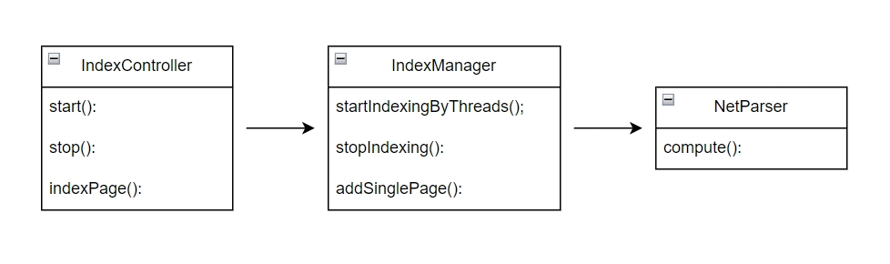
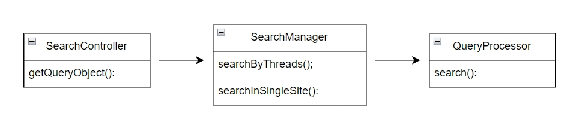
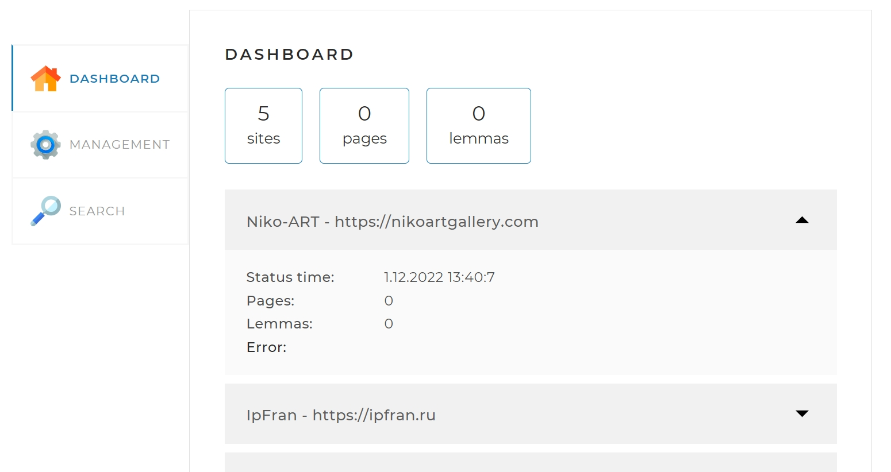

<a id = "top"></a>
# SearchEngine
---
Spring - REST приложение, позволяющее обходить все страницы заданных сайтов и индексировать их так, чтобы потом находить наиболее релевантные страницы по любому поисковому запросу.

## Стек используемых технологий:
- SpringBoot
- Hibernate
- MySQL
- Java - libs:
  - Jsoup
  - LuceneMorfology
  - Commons - io
  - Lombok
---
## Структура проекта
Проект с подключенными библиотеками лемматизаторами. Содержит несколько контроллеров, сервисов и репозиториев с подключением к бд MySQL.

В части индексации порядок классов бизнес-логики следующий:


В классе IndexManager содержатся методы запуска, остановки, добавления отдельной страницы и сбора статистики, класс NetParser непосредственно обрабатывает страницы с использованием технологии ForkJoin.

В части обработки поискового запроса порядок классов аналогичный:


В классе SearchController  происходит выбор метода поиска по одному сайту или по всем, в классе SearchManager реализованы эти методы, в классе QueryProcessor непосредственно поиск. Ключевая технология здесь представлена нативным SQL-запросом:

```java
@Query(value = "SELECT * FROM page p " +
            "JOIN `index` i ON p.id = i.page_id " +
            "JOIN lemma l ON l.id = i.lemma_id " +
            "WHERE l.lemma IN (:lemmasList) " +
            "AND l.site_id = :id " +
            "GROUP BY p.path " +
            "HAVING COUNT(*) = :count " +
            "ORDER BY SUM(i.rank) DESC", nativeQuery = true)
    List<Page> findPagesByNativeQueryWithSiteId(@Param("lemmasList") Set<String> lemmasList,
                                      @Param("count") int count,
                                                @Param("id") int siteId);

```
---
## Запуск и настройка
Настройки для запуска приложения находятся в конфигурационном файле `application.yaml`.

```yaml
spring.datasource:
  url: jdbc:mysql://localhost:3306/myDB?useUnicode=true&serverTimezone=UTC
  username: root
  password: testtest
spring.jpa.hibernate.ddl-auto: validate


spring.jpa:
    show-sql: false
    properties.hibernate:
        dialect: org.hibernate.dialect.MySQL8Dialect
        jdbc.batch_size: 4
        order_inserts: true
        generate_statistics: false

sitelist:
  sites:
  - url: https://nikoartgallery.com
    name: Niko-ART
  - url:  https://ipfran.ru
    name: IpFran
  - url: https://www.svetlovka.ru
    name: Svetlovka
  - url: http://www.playback.ru
    name: Playback
  - url: https://et-cetera.ru/mobile
    name: Et-Cetera
  agent:
    user-agent: Mozilla/5.0 (Windows NT 10.0; Win64; x64) AppleWebKit/537.36 (KHTML, like Gecko) Chrome/107.0.0.0 Safari/537.36
    referrer: http://www.google.com

server:
  port: 8080
  servlet:
    context-path: /
```

1. Перечень сайтов, которые необходимо индексировать. Это должен быть массив объектов, содержащих адрес и имя сайта. В перечне могут находиться как один, так и несколько сайтов. Адреса всех сайтов должны быть полные и не должны содержать слеш в конце.

```yaml
sites:
  - url: https://nikoartgallery.com
    name: Niko-ART
  - url:  https://ipfran.ru
    name: IpFran
  - url: https://www.svetlovka.ru
    name: Svetlovka
  - url: http://www.playback.ru
    name: Playback
  - url: https://et-cetera.ru/mobile
    name: Et-Cetera
```

2. Имя User-Agent, который необходимо подставлять при запросах страниц сайтов. Это необходимо, чтобы корректно представлять свой поисковый движок сайту.

```yaml
agent:
    user-agent: Mozilla/5.0 (Windows NT 10.0; Win64; x64) AppleWebKit/537.36 (KHTML, like Gecko) Chrome/107.0.0.0 Safari/537.36
    referrer: http://www.google.com
```

3. Данные доступа к локальной базе данных MySQL: хост, логин, пароль, имя базы.

```yaml
spring.datasource:
  url: jdbc:mysql://localhost:3306/myDB?useUnicode=true&serverTimezone=UTC
  username: root
  password: testtest
spring.jpa.hibernate.ddl-auto: validate
```

Создайте вашу локальную базу данных и задайте ее имя в конфигурации. При первом запуске приложения необходимо выставить настройку для создания всех необходимых таблиц: 

```
spring.jpa.hibernate.ddl-auto: create
```
Далее поменяйте эту настройку на validate или none и перезапустите приложение. 


4. Путь к веб-интерфейсу по умолчанию:

```yaml
server:
  port: 8080
  servlet:
    context-path: /
```

В браузере укажите путь к хосту на котором размещено веб-приложение:
```
http://localhost:8080
```

Если всё сделано правильно, то приложение будет иметь вид:

Приложение готово к использованию!

[В начало](#top)
